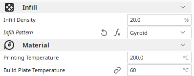
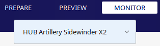

# HowToDo

## Use Cura and the Artillery Sidewinder x2

#### Experience / HUB Project

 

In order to print print an object with the **Artillery Sidewinder x2**, first open **Ultimaker Cura**.

 

Open your `.stl` file and make sure in the specification of your project :

- The material is correctfully set to *Gyroid*.
- The temperature of the nozzle is suitable to the wire. It should never be more than 220°C.
- The temperature of the plate is suitable to the wire. It should never be more than 60°C.

 

Then slice your project to create the data of the printing.

**MAKE SURE TO CLEAN THE PLATE WITH ALCOHOL BEFORE EVERY PRINT TO AVOID ANY TAKE-OFF**

 

You can start a print by 3 methods.

- With a USB key. **Never do that or it will crash during the print**.

- With a SD Card. This is a good way to print but it make you use the screen of the printer.

- With the computer monitoring. Just click on the `Monitor` section and start printing.

 

Technically you must not touch the level adjustment under the plate but in case you need to check [this](https://youtu.be/vowdKNIh0Z8) [video](https://youtu.be/dQw4w9WgXcQ).

I will not make a tutorial on *How to change the wire ?* because i hope you know how to click on 3 buttons on the printer. :)