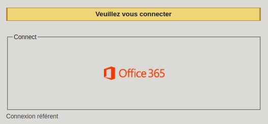
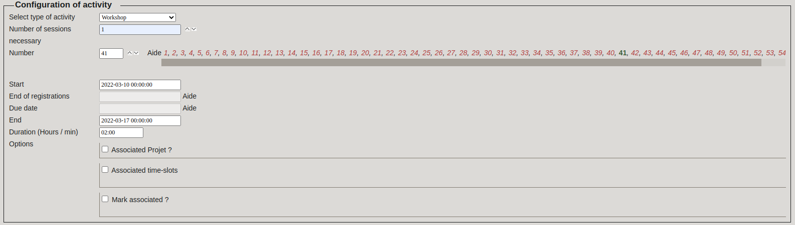
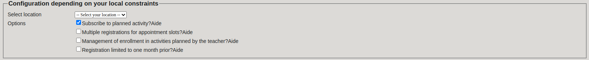
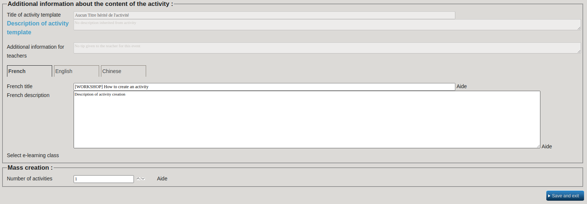

# HowToDo

## Create activity on intranet

#### Talk / Workshop

In order to create a new activity on the Epitech intranet go [here](https://intra.epitech.eu/) and login with your office 360 account.

Then go to Units -> B0-HUB (1) on semester 0.

Create an activity by clicking on the corresponding button.

First choose the type of activity, here `Talk` or `Workshop`.

Set `Number of sessions` to 1.

Click on the field next to `Number` and **do not** change the number inside.

Select the `Start` and `End` date. Set the `End` date to a long date after the session so you are able to change a session planned if needed (we will see after).

Select the `Duration of the activity`.

For Talk/Workshop their is no `Associated Project`, `Associated time-slots` and `Mark Associated`.

Then you must **NOT** select the location of your activity here.

Check `Subscribe to planned activity ?` so the students can register themselves to the activity.

Set the title of your activity with the right flags and then the title.
For example `[TALK]` and maybe `/!\TEK1 ONLY/!\` if needed.

Paste the activity's description.

Do not change the `Number of activities`.

`Save and Exit`

