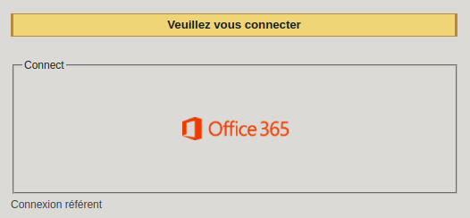

# HowToDo

## Create an activity on the intranet

#### Experience / HUB Project

 

In order to create a new activity on the Epitech intranet go [here](https://intra.epitech.eu/) and login with your office 360 account.

 
 

Then go to Units -> B0-HUB (1) on semester 0.

 
 

Create an activity by clicking on the corresponding button.

 
 

First choose the type of activity, here `Experience` or `Project`.

Set `Number of sessions` to 1.

Click on the field next to `Number` and **do not** change the number inside.

Select the `Start` and `End` date. Set the `End` date to a long date after the session so you are able to change a session planned if needed (we will see after).

**Do not** select the `Duration of the activity`.

Select the Experience or HUB Project `Associated Project`.

You can then choose the `End of registration` and `Due Date`.

For an experience or a Project their is no `Associated time-slots` and `Mark Associated` checkbox.

Then you must **NOT** select the location of your activity here.

Check `Subscribe to planned activity ?`.

 
 

Set the title of your activity with the `[EXPERIENCE]` of `[HUB PROJECT]` flag and then the title.

Paste the activity's description.

Do not change the `Number of activities`.

`Save and Exit`

 
 

Then you must create the sessions by clicking on `View Project Details`.

 
 

`Forced registration` the student.

 
 

Fill every fields corresponding to the student and `Apply`.

 
 

When the review is done click on `Mark`.

 
 

Set the mark regarding the quality of the project.

 
 

For a HUB Project the `Start` and `End` must be set regarding the evaluation from Epitech National
