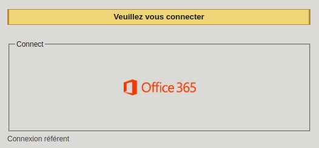
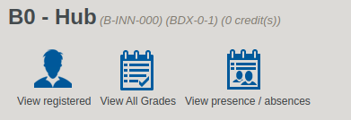
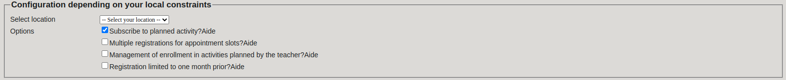
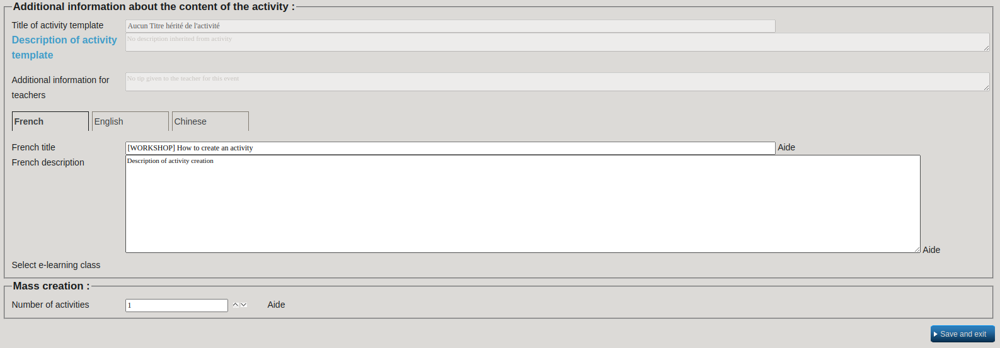
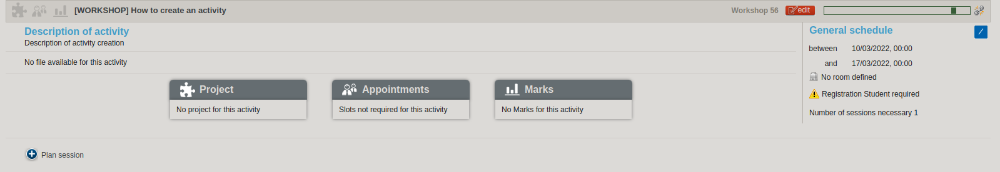
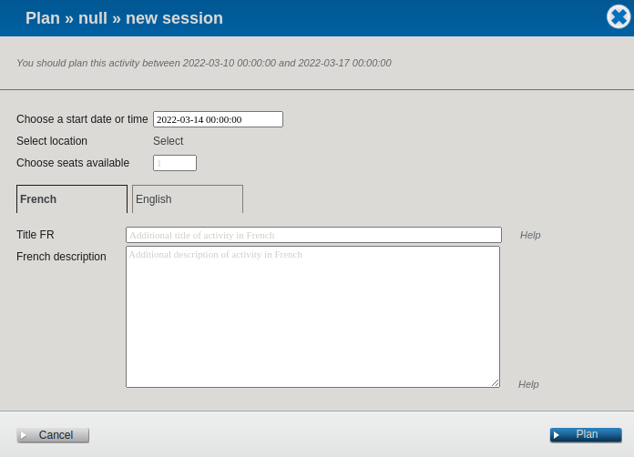
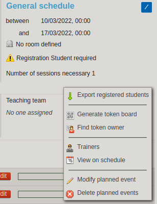
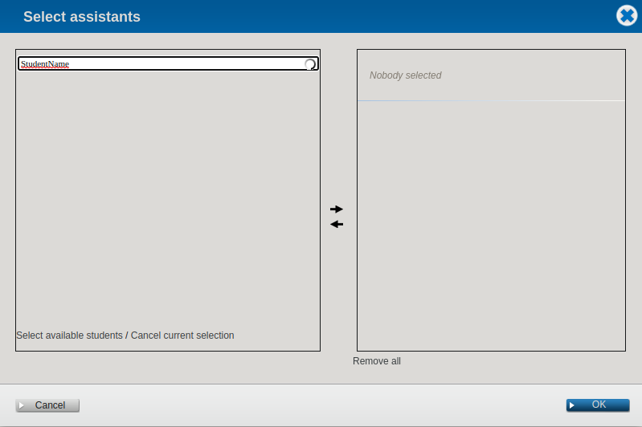

# HowToDo

## Create an activity on the intranet

#### Talk / Workshop / Hackaton

 

In order to create a new activity on the Epitech intranet go [here](https://intra.epitech.eu/) and login with your office 360 account.

 
 

Then go to Units -> B0-HUB (1) on semester 0.

 
 

Create an activity by clicking on the corresponding button.

 
 

First choose the type of activity, here `Talk`, `Workshop` or `Hackaton`.

Set `Number of sessions` to 1.

Click on the field next to `Number` and **do not** change the number inside.

Select the `Start` and `End` date. Set the `End` date to a long date after the session so you are able to change a session planned if needed (we will see after).

Select the `Duration of the activity`.

For Talk/Workshop/Hackaton their is no `Associated Project`, `Associated time-slots` and `Mark Associated`.

 
 

Then you must **NOT** select the location of your activity here.

Check `Subscribe to planned activity ?` so the students can register themselves to the activity.

 
 

Set the title of your activity with the right flags and then the title.
For example `[TALK]`, `[HACKATON]` and maybe `/!\TEK1 ONLY/!\` if needed.

Paste the activity's description.

Do not change the `Number of activities`.

`Save and Exit`

 
 

Then you must create the sessions by clicking on `Plan Session`

 
 

Here select the `Start date or time`.

Then select the `Location`.
**Please refer to you room manager to get an available room !!**

**Do not** set another title and description here.

`Plan`

 
 

Finally, set a trainer to the activity so he can receive his XPs.
For this, click on the pencil on the right and go to `Trainers`.

 
 

Search the trainers on the searchbar on top and click on the right pointing arrow.
Then `OK`.

 
 
 

**DON'T FORGET TO SET THE TEACHER AS PRESENT WHEN THE ACTIVITY IS DONE**