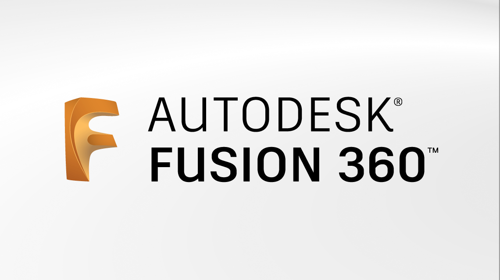

# HowToDo

## Modelization with Fusion 360

#### Experience / HUB Project

 

First of all, you need to download the application `Fusion 360`.
The app is paid so you must downloadit following [this tutorial](https://www.youtube.com/watch?v=CMw-iH8DXPc).

 
 

Then for some basics you can check [this video](https://www.youtube.com/watch?v=bnl5oqtk_SY).

 
 

About creating text shapes [here](https://www.youtube.com/watch?v=3ZwX7dRu3xI) is a cool video too.

 
 

In general, this youtube channel posts good tutorials.

 

