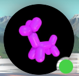
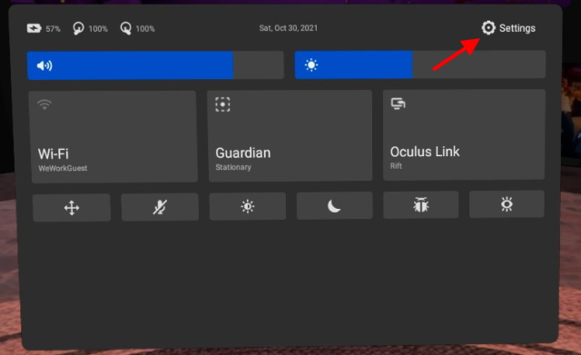

# HowToDo

## Virtual Reality

**CAREFUL THE CABLE IS IN FIBER, SO IT'S VERY BRITTLE**

#### How to start VR

 

In order to start the VR system, you first need to plug in the USB C cable to the computer and to the headset.
On the computer start the Oculus and Steam apps.
Launch Steam VR.

Then start the VR headset and select the profile "Hub Bordeaux".

When in the Japan sylish house, click on settings on the bottom bar and click on **Oculus Link** on the right.

You are now on the Oculus Link menu you can click on library and start the Steam VR app where you can find your games!

 

#### How to add new music on Beat Saber

First go to [beatsaver.com](https://beatsaver.com/) and select the song you would like to add.

Download the `.zip` file.

Extract it to this path on the computer:
`C:\Program Files (x86)\Steam\steamapps\common\Beat Saber\Beat Saber_Data\CustomLevels`
If needed you can rename it.

It now should be available in the custom levels